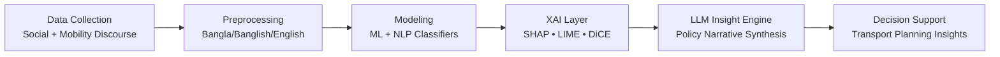

<div align="center">


[](https://git.io/typing-svg)


### **I design AI-driven research pipelines that translate urban mobility signals into explainable, actionable insights.**

</div>

---

## 🔗 Quick Links

<div align="center">

[](#-about-me)
[](#-research-focus)
[](#-research-pipeline-visualization)
[](#-featured-outputs--preprints)
[](#-skills--tech-stack)
[](#-connect--collaborate)

</div>

---

## 🧑‍🔬 About Me

I am a **Master's researcher** in Transportation Engineering at the **Faculty of Engineering, Chulalongkorn University, Thailand**, working at the intersection of **AI, NLP, and Smart Transportation Systems**.

My current work applies **Natural Language Processing (NLP)**, **Explainable AI (XAI)**, and **Large Language Models (LLMs)** to understand public sentiment toward urban mobility in **Bangladesh's rapidly evolving multi-modal transport ecosystem**.

```python
mahbub = {
    "institution": "Chulalongkorn University, Bangkok, Thailand",
    "degree": "MSc in Transportation Engineering",
    "research": ["NLP", "XAI", "LLM", "Sentiment Analysis", "Smart Mobility"],
    "languages": ["Python", "R", "MATLAB", "SQL", "LaTeX"],
    "currently": "Building an ML + XAI + LLM pipeline for transport sentiment intelligence",
}
```

---

## 📌 Quick Stats & Achievements

<div align="center">

| 🎓 Academic Track | 🔬 Research Scope | 📊 Data Footprint | 🧠 Current Focus |
|---|---|---|---|
| MSc @ Chulalongkorn University | Transportation Engineering × AI/NLP | 8,000 multilingual transport discourse records | Explainable sentiment modeling + policy insight generation |

</div>

---

## 🎯 Research Focus

| Domain | Topics |
|---|---|
| 🚇 **Smart Transportation** | ITS, Urban Mobility, Multi-modal Systems, Developing Countries |
| 🗣️ **NLP & Text Mining** | Sentiment Analysis, ABSA, Multilingual (Bangla/Banglish/English) |
| 🔍 **Explainable AI (XAI)** | SHAP, LIME, DiCE Counterfactuals, Feature Importance |
| 🧠 **Large Language Models** | Open-source LLMs, LLM-in-the-loop research automation |
| 📊 **Machine Learning** | Classification, Ensemble Methods, Hyperparameter Tuning (Optuna) |
| 🌱 **Sustainable Mobility** | Green Transport, EV Adoption, CAV, MaaS |

---

## 🧭 Research Pipeline Visualization



---

## 🚀 Featured Research Project

### 🗣️ Public Transport Sentiment Analysis — Bangladesh

> *A multilingual NLP · ML · XAI · LLM research pipeline for emerging-market transport discourse.*

<table>
<tr><td><b>Dataset</b></td><td>8,000 synthetic social media records (Facebook · YouTube · Twitter · Instagram · Reddit)</td></tr>
<tr><td><b>Languages</b></td><td>Bangla (40%) · Banglish (35%) · English (25%)</td></tr>
<tr><td><b>Sentiment</b></td><td>Negative · Positive · Neutral (50/30/20 %)</td></tr>
<tr><td><b>Aspects (ABSA)</b></td><td>12 aspects — fare, safety, comfort, punctuality, overcrowding, cleanliness, infrastructure, accessibility, service quality, route coverage, driver behavior, staff behavior</td></tr>
<tr><td><b>Transport Modes</b></td><td>13 modes — MRT-6, BRTC, AC Bus, Local Bus, Intercity Train, CNG, Rickshaw, Pathao, Shohoz, Uber, inDrive, Launch/Ferry, Tempo</td></tr>
<tr><td><b>Validation</b></td><td>12/12 checks ✅ · 99.5% unique texts · Date range: Dec 2022 – Dec 2024</td></tr>
<tr><td><b>Phase 2</b></td><td>ML Classification + SHAP/XAI + LLM-based policy insight generation <i>(in progress)</i></td></tr>
</table>

---

## 📚 Featured Outputs & Preprints

- **Manuscript in preparation:** *Multilingual Public Transport Sentiment Intelligence for Bangladesh: An NLP + XAI Framework*
- **Research artifact:** Structured synthetic corpus for multi-platform transport sentiment benchmarking
- **Ongoing output:** Explainability dashboard design for stakeholder-facing mobility analytics

> _If you are interested in co-authoring, benchmarking, or extending this pipeline to other cities, let's collaborate._

---

## 🛠️ Skills & Tech Stack

### 💻 Programming


### 🤖 AI / ML / NLP


### 🧰 Tools & Platforms


---

## 📈 GitHub Analytics

<div align="center">


</div>

---

## 🏅 Trophies

<div align="center">


</div>

---

## 🤝 Connect & Collaborate

<div align="center">

[](mailto:6870376421@student.chula.ac.th)
[](mailto:mahbub.fkta@gmail.com)
[](https://github.com/mahbubchula)
[](https://www.linkedin.com/search/results/all/?keywords=Mahbub%20Hassan)
[](https://www.researchgate.net/search/publication?q=Mahbub%20Hassan)
[](https://scholar.google.com/scholar?q=Mahbub+Hassan+Transportation+Engineering)

</div>

### 📣 Open to Collaboration

- AI for Transportation Planning & Policy
- Multilingual Transport Sentiment / ABSA Research
- Explainable ML systems for infrastructure and mobility decisions

---

## 🧪 Latest Research Updates

- 🔄 **Phase 2 ongoing:** classification experiments + explainability profiling
- 🧭 **Current direction:** LLM-assisted policy insight generation from sentiment evidence
- 🤝 **Opportunity:** open to research collaboration, benchmarking partnerships, and academic networking

---

<div align="center">

### 💡 *"Bridging Data Science and Sustainable Transportation — one model at a time."*


</div>
