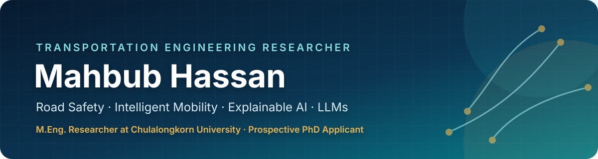

  

   

  
  
  
  

<table>
<tr>
<td align="center" width="25%"><strong>M.Eng.</strong> Transportation Engineering Chulalongkorn University</td>
<td align="center" width="25%"><strong>Full Scholarship</strong> ASEAN and Non-ASEAN Countries Scholarship</td>
<td align="center" width="25%"><strong>IEEE</strong> Graduate Student Member</td>
<td align="center" width="25%"><strong>Research Lead</strong> Founder, B'Deshi Research Lab</td>
</tr>
</table>

`Road Safety` · `Driver Behaviour` · `Intelligent Transportation Systems` · `Sustainable Mobility` · `Explainable AI` · `LLMs for Transportation`

[**Research**](#-current-research) · [**Software**](#-selected-research-software) · [**Publications**](#-publications) · [**Methods**](#-methods-and-research-tools) · [**Leadership**](#-academic-leadership-and-service) · [**Contact**](#-connect)

## 🔬 Research profile

I am an **M.Eng. researcher in Transportation Engineering at Chulalongkorn University**, supported by the university's full ASEAN and Non-ASEAN Countries Scholarship. My work sits at the intersection of **road safety, driver behaviour, intelligent transportation systems, sustainable mobility, explainable machine learning, and responsible LLM applications in transportation**.

I build reproducible analytical workflows that connect transportation data to decisions: from crash-severity modelling and behavioural analysis to traffic simulation, edge intelligence, and policy evaluation. My aim is to produce research that is methodologically rigorous, interpretable, and useful to transportation practitioners and policymakers.

> **Research direction:** human-centred, data-driven transportation safety and intelligent mobility systems, with a focus on transparent methods and policy-relevant evidence.

## 📍 Current research

<table>
<tr>
<td width="58%" valign="top">

### [South Australia Road Crash Severity](https://github.com/mahbubchula/sa-road-crash-research)

A submission-ready study combining spatiotemporal risk profiling, inferential statistics, comparative machine learning, robustness analysis, and explainable AI across **190,910 crashes from 2012-2024**.

| Evidence base | Modelling | Validation | Explainability |
|:---:|:---:|:---:|:---:|
| **190,910** crashes | **5** algorithms | **4** robustness checks | **4** XAI methods |
| 2012-2024 | ROC-AUC **0.849** | Temporal + sensitivity | SHAP + model-agnostic |

[**Explore the research repository →**](https://github.com/mahbubchula/sa-road-crash-research)

</td>
<td width="42%" align="center" valign="middle">
  
</td>
</tr>
</table>

## 📊 Research snapshots

<table>
<tr>
<td width="50%" align="center" valign="top">
  
   <b>Thirteen-year crash trend</b> Frequency and severity composition, 2012-2024
</td>
<td width="50%" align="center" valign="top">
  
   <b>Adjusted risk factors</b> Multivariable odds ratios with 95% confidence intervals
</td>
</tr>
<tr>
<td width="50%" align="center" valign="top">
  
   <b>Comparative model evaluation</b> ROC and precision-recall curves across five algorithms
</td>
<td width="50%" align="center" valign="top">
  
   <b>Explainable machine learning</b> Global SHAP effects for crash-severity prediction
</td>
</tr>
</table>

Figures are generated by the reproducible workflow in the <a href="https://github.com/mahbubchula/sa-road-crash-research">South Australia Road Crash Severity repository</a>.

## 🧰 Selected research software

<table>
<tr>
<td width="50%" valign="top">

### [Thai AccidentIQ AI](https://github.com/mahbubchula/Thai-AccidentIQ-AI)

Road-accident severity analytics for Thailand using 81,735 records, four tuned ensemble models, SHAP explanations, and a policy-facing dashboard.

`Road Safety` `XAI` `Streamlit`

</td>
<td width="50%" valign="top">

### [Adaptive TinyML Traffic Prediction](https://github.com/mahbubchula/TinyML-Traffic-Prediction)

Few-shot edge traffic forecasting with a **5.46 KB** quantised model and 48-hour domain adaptation. Published at IEEE PECCII 2026.

`TinyML` `ITS` `Edge AI`

</td>
</tr>
<tr>
<td width="50%" valign="top">

### [clickSUMO](https://github.com/mahbubchula/clickSUMO)

Open-source platform for one-click SUMO network creation, simulation, RAG-assisted documentation, and intelligent signal optimisation.

`Traffic Simulation` `SUMO` `Research Software`

</td>
<td width="50%" valign="top">

### [EcoMoveAI](https://github.com/mahbubchula/ecoMoveAI)

Transparent scenario-based evaluation of transport CO2, fuel costs, carbon pricing, subsidies, congestion charges, and marginal abatement costs.

`Sustainable Mobility` `Policy Analysis` `Reproducibility`

</td>
</tr>
<tr>
<td width="50%" valign="top">

### [ParkSense-AI](https://github.com/mahbubchula/ParkSense-AI)

Real-time parking intelligence across 2,500+ Singapore carparks using HDB, LTA, and URA data for operational and planning insight.

`Urban Analytics` `Open Data` `Decision Support`

</td>
<td width="50%" valign="top">

### [Research for Everybody](https://github.com/mahbubchula/research-for-everybody-course)

An open, 18-module research-methodology course spanning question formulation, study design, analysis, academic writing, and publication.

`Open Education` `Research Methods` `Mentoring`

</td>
</tr>
</table>

## 📚 Publications

My work spans transportation safety, travel behaviour, intelligent mobility, sustainable transport, simulation, explainable AI, extended reality, and large language models for transportation. The complete and current record is maintained on [Google Scholar](https://scholar.google.com/citations?user=PGwRExQAAAAJ&hl=en).

<b>Recent accepted articles</b>

<!-- Add newly accepted articles immediately below this comment. -->

1. **Hassan, M.**, Sarkar, P., Islam, M. K., & Rahman, M. M. H. (2026). *Willingness to adopt Mobility as a Service in a pre-deployment context: Evidence from Bangladesh using a dual-method framework*. **Journal of Public Transportation**. Accepted for publication. [DOI](https://doi.org/10.1016/j.jpubtr.2026.100176)
2. **Hassan, M.**, Turjo, T. D., Islam, M. K., & Rahman, M. M. (2026). *A machine learning and explainable AI framework for long distance travel mode choice: Evidence from Bangladesh*. **Scientific Reports**. Accepted for publication. [DOI](https://doi.org/10.1038/s41598-026-56550-1)
3. **Hassan, M.**, Paul, A., Parven, A., & Amin, M. B. (2026). *Mobility-as-a-Service for sustainable transportation: A bibliometric and thematic review*. **Journal of Transformative Technologies and Sustainable Development**. Accepted for publication. [DOI](https://doi.org/10.1007/s41314-026-00097-6)
4. Turjo, T. D., **Hassan, M.**, Islam, M. K., & Haque, M. E. (2026). *Explainable AI in transportation safety and risk assessment: A bibliometric and critical review of emerging trends, applications, open challenges, and future directions*. **Archives of Computational Methods in Engineering**. Accepted for publication.

<b>Selected published articles</b>

<!-- Add newly selected published articles immediately below this comment. -->

1. **Hassan, M.**, Turjo, T. D., Islam, M. K., & Rahman, M. M. (2026). *The trapped driver phenomenon: Risky driving intention among professional drivers in Bangladesh*. **Transportation Research Part F**, 122, 103789. [DOI](https://doi.org/10.1016/j.trf.2026.103789)
2. **Hassan, M.**, Choocharukul, K., Islam, M. A., & Basaruddin, K. S. (2026). *Explainable machine learning for binary casualty prediction: Evidence from New South Wales*. **Results in Engineering**, 112401. [DOI](https://doi.org/10.1016/j.rineng.2026.112401)
3. **Hassan, M.**, Turjo, T. D., Rambe, A. H., et al. (2026). *A comprehensive survey of adaptive traffic signal control: Methods, applications, challenges, and future research*. **Archives of Computational Methods in Engineering**. [DOI](https://doi.org/10.1007/s11831-026-10574-y)
4. **Hassan, M.**, Islam, M. K., Alam, M. S., et al. (2026). *Applications of IoT in intelligent transportation systems: Research landscape, technological innovations, challenges, and future opportunities*. **Computers, Materials & Continua**. [DOI](https://doi.org/10.32604/cmc.2026.085434)
5. **Hassan, M.**, Kabir, M. E., Jusoh, M., Ki An, H., Negnevitsky, M., & Li, C. (2025). *Large language models in transportation: A comprehensive bibliometric analysis of emerging trends, challenges, and future research*. **IEEE Access**, 13, 132547-132598. [DOI](https://doi.org/10.1109/ACCESS.2025.3589319)
6. **Hassan, M.**, Shraban, S. S., Islam, M. A., Basaruddin, K. S., Ijaz, M. F., Kamarrudin, N. S. B., & Takemura, H. (2025). *Integration of extended reality technologies in transportation systems: A bibliometric analysis and review of emerging trends, challenges, and future research*. **Results in Engineering**, 26, 105334. [DOI](https://doi.org/10.1016/j.rineng.2025.105334)
7. **Hassan, M.**, Ray, S. C., Gupta, A. B., & Hassan, M. M. (2026). *Few-shot adaptive tiny machine learning for edge-based traffic flow prediction*. **IEEE PECCII 2026**. [DOI](https://doi.org/10.1109/PECCII70991.2026.11662000)

[**View the complete publication record on Google Scholar →**](https://scholar.google.com/citations?user=PGwRExQAAAAJ&hl=en)

## 🧪 Methods and research tools

| Area | Methods and tools |
|---|---|
| **Machine learning & XAI** | Python, scikit-learn, PyTorch, XGBoost, LightGBM, SHAP, LIME |
| **Transportation modelling** | SUMO, VISSIM, MATSim, CARLA, SIDRA |
| **Statistics & behavioural research** | R, SPSS, SmartPLS 4, regression, PLS-SEM, fsQCA |
| **Spatial & research workflows** | QGIS, LaTeX, VOSviewer, Biblioshiny, reproducible reporting |

## 🎓 Academic leadership and service

<table>
<tr>
<td width="50%" valign="top">

### Research leadership

Founded and lead **B'Deshi Research Lab**, an international transportation research group. Mentored **20+ undergraduate researchers** in research design, analysis, and scholarly publication.

</td>
<td width="50%" valign="top">

### Scholarly service

Invited reviewer for **31 manuscripts across 21 journals**, including *Journal of Cleaner Production*, *Scientific Reports*, and *Engineering Applications of Artificial Intelligence*.

</td>
</tr>
<tr>
<td width="50%" valign="top">

### Open education

Create free learning resources in research methods, statistics, machine learning, bibliometric analysis, and intelligent transportation systems.

</td>
<td width="50%" valign="top">

### Recognition

Full Chulalongkorn graduate scholarship, **2nd Place Best Paper at ICSM 2025**, Best International Student at UniMAP, and five Dean's List awards.

</td>
</tr>
</table>

I also create research and engineering content on [YouTube](https://www.youtube.com/@dailymahbub), reaching 1,000+ subscribers and 100,000+ views.

## 🤝 Connect

I welcome research conversations and collaboration in road safety, driver behaviour, intelligent transportation systems, sustainable mobility, and interpretable transportation analytics.

Bangkok, Thailand · Transportation Engineering, Chulalongkorn University

